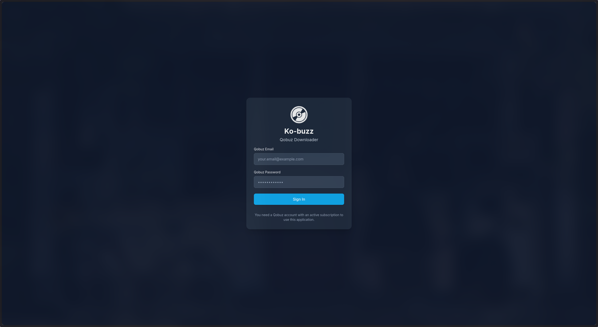
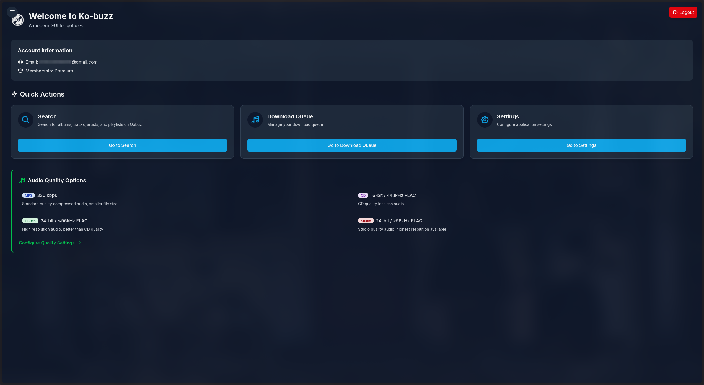
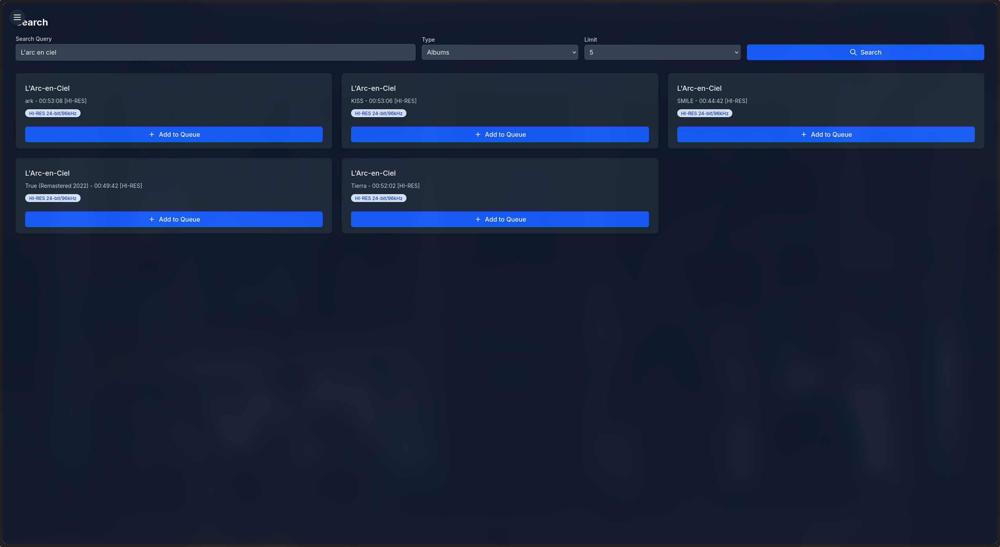
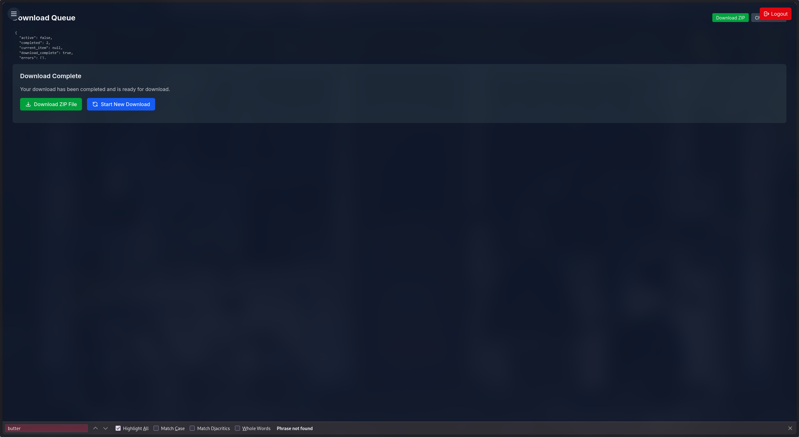
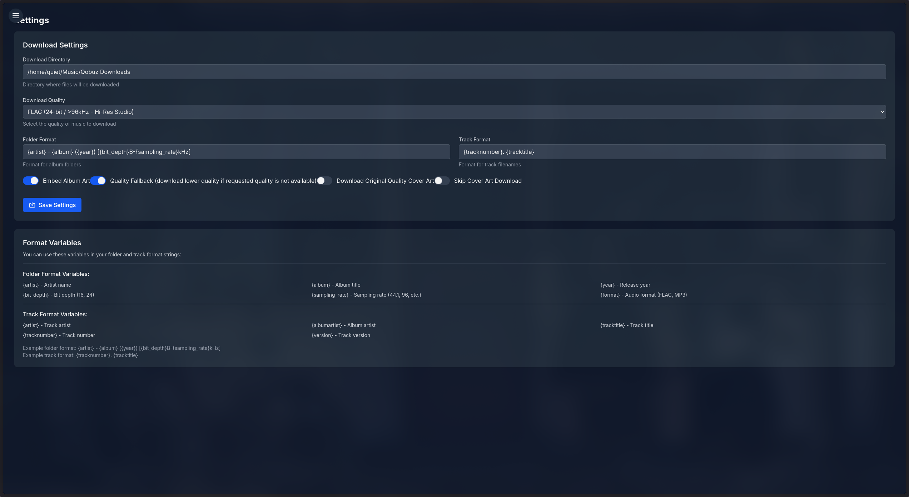

# kobuzz

<div align="center">
  
  <h3>A modern GUI frontend for qobuz-dl</h3>
</div>

kobuzz is a sleek, user-friendly graphical interface for the qobuz-dl library, designed to simplify the process of downloading music from Qobuz. With its intuitive interface and powerful features, kobuzz makes it easy to search, queue, and download your favorite music in high-quality formats.

## 📸 Screenshots

The following screenshots showcase the key features and interfaces of kobuzz. The application offers both light and dark themes to suit your preferences.

<div align="center">
  
  <p><em>Login Screen</em></p>

  
  <p><em>Dashboard</em></p>

  <div style="background-color: #0f172a; padding: 20px; border-radius: 8px; margin-bottom: 20px;">
    
  </div>
  <p><em>Search Results</em></p>

  
  <p><em>Download Complete</em></p>
  
  
  <p><em>Settings</em></p>

</div>

These screenshots demonstrate the intuitive workflow of kobuzz - from logging in with your Qobuz credentials, browsing the dashboard, searching for music, configuring settings, to completing downloads. The application provides visual feedback at each step to ensure a smooth user experience.

## ✨ Features

- **Modern, Responsive UI**: Built with React 19, Tailwind CSS 4, and Material UI 7
- **Comprehensive Search**: Find albums, tracks, artists, and playlists with detailed results
- **Download Queue Management**: Add multiple items to your download queue and manage them easily
- **Quality Selection**: Choose between different quality options (MP3, FLAC 16-bit, FLAC 24-bit)
- **Format Customization**: Customize folder and filename formats to your preference
- **Dark/Light Theme**: Switch between dark and light themes for comfortable viewing in any environment
- **Detailed Audio Information**: View bit depth, sampling rate, and year information in search results
- **ZIP Compression**: Download files as ZIP archives directly from the frontend
- **Responsive Design**: Works on desktop and mobile devices

## 🏗️ Architecture

kobuzz consists of two main components:

1. **Backend**: A Flask API that interfaces with the qobuz-dl library
   - Handles authentication with Qobuz
   - Processes search requests
   - Manages downloads
   - Provides configuration options

2. **Frontend**: A React application built with Vite
   - Modern UI with Tailwind CSS and Material UI components
   - Responsive design for all device sizes
   - Intuitive user experience

## 🔧 Prerequisites

- Python 3.12+
- Node.js 18+
- npm or yarn
- A Qobuz account with an active subscription

## 📦 Installation

### Clone the repository

```bash
git clone https://github.com/notquitethereyet/kobuzz.git
cd kobuzz
```

### Set up the backend

```bash
cd backend
pip install .
```

### Set up the frontend

```bash
cd frontend
npm install
```

## 🚀 Running the application

### Start the backend

```bash
cd backend
python -m app
```

The backend API will be available at http://localhost:5000.

### Start the frontend

```bash
cd frontend
npm run dev
```

The frontend will be available at http://localhost:5173.

## 📝 Usage

1. **Login**: Open the application in your browser and log in with your Qobuz credentials
2. **Search**: Use the search page to find albums, tracks, artists, or playlists
   - Enter at least 3 characters for valid search results
   - Select the type of content you're looking for (album, track, artist, playlist)
   - Choose the number of results to display
3. **Queue**: Add items to your download queue by clicking the "Add to Queue" button
4. **Configure**: Set your preferred download quality and other options
5. **Download**: Start the download process and monitor progress
6. **Enjoy**: Access your downloaded music in the specified directory

## ⚙️ Configuration

### Application Settings

You can configure various settings in the application:

- **Download Directory**: Where your music files will be saved
- **Quality Preferences**: Choose between different audio quality options
- **Folder Format**: Customize how folders are named (e.g., `{artist} - {album} ({year})`)
- **Track Format**: Customize how tracks are named (e.g., `{tracknumber}. {tracktitle}`)
- **Cover Art Options**: Configure artwork embedding and quality

### Environment Variables

Both the frontend and backend use environment variables for configuration. You can customize these by creating or modifying the `.env` files.

#### Frontend Environment Variables (frontend/.env)

```
# API URL - change this to point to your backend server
VITE_API_URL=http://localhost:5000/api
```

For production, you can create a `.env.production` file:

```
# API URL for production - this assumes the backend is on the same server
VITE_API_URL=/api
```

#### Backend Environment Variables (backend/.env)

```
# Flask settings
FLASK_HOST=127.0.0.1
FLASK_PORT=5000
FLASK_DEBUG=True

# CORS settings - add your frontend URL(s) here
CORS_ALLOW_ORIGINS=http://localhost:5173,http://127.0.0.1:5173

# Qobuz-dl settings
DEFAULT_DOWNLOAD_DIR=~/Music/Qobuz Downloads
DEFAULT_QUALITY=6
DEFAULT_EMBED_ART=True
DEFAULT_FOLDER_FORMAT={artist} - {album} ({year}) [{bit_depth}B-{sampling_rate}kHz]
DEFAULT_TRACK_FORMAT={tracknumber}. {tracktitle}
DEFAULT_QUALITY_FALLBACK=True
DEFAULT_COVER_OG_QUALITY=False
DEFAULT_NO_COVER=False

# Config file location
CONFIG_FILE=~/.kobuzz/config.json
```

### Quality Settings

kobuzz supports the following quality options:

| Value | Quality                     | Description                                |
|-------|-----------------------------|--------------------------------------------|
| 5     | MP3 320kbps                 | Standard compressed audio                  |
| 6     | FLAC 16-bit / 44.1kHz       | CD-quality lossless audio                  |
| 7     | FLAC 24-bit / up to 96kHz   | High-resolution lossless audio             |
| 27    | FLAC 24-bit / up to 192kHz  | Maximum quality high-resolution audio      |

## 🌐 Hosting for Personal Use

To host the application for personal use:

1. Set up the backend on your server
2. Configure the environment variables as needed
3. Build the frontend for production: `cd frontend && npm run build`
4. Serve the frontend build directory with a web server (nginx, Apache, etc.)
5. Configure your web server to proxy API requests to the backend

Example nginx configuration:

```nginx
server {
    listen 80;
    server_name your-domain.com;

    root /path/to/kobuzz/frontend/dist;
    index index.html;

    location / {
        try_files $uri $uri/ /index.html;
    }

    location /api {
        proxy_pass http://127.0.0.1:5000;
        proxy_set_header Host $host;
        proxy_set_header X-Real-IP $remote_addr;
        proxy_set_header X-Forwarded-For $proxy_add_x_forwarded_for;
        proxy_set_header X-Forwarded-Proto $scheme;
    }
}
```

## 🧩 Dependencies

### Backend Dependencies

- **Flask**: Web framework for the API
- **Flask-CORS**: Cross-Origin Resource Sharing support
- **qobuz-dl**: Core library for Qobuz interaction
- **python-dotenv**: Environment variable management
- **requests**: HTTP client
- **mutagen**: Audio metadata handling
- **pathvalidate**: Path validation utilities
- **tqdm**: Progress bar utilities
- **beautifulsoup4**: HTML parsing
- **colorama**: Terminal color support

### Frontend Dependencies

- **React**: UI library
- **React Router**: Navigation
- **Tailwind CSS**: Utility-first CSS framework
- **Material UI**: Component library
- **Axios**: HTTP client
- **Vite**: Build tool and development server

## 📜 License

This project is licensed under the "Do Whatever With This Thing" license.

## 🙏 Acknowledgements

- [qobuz-dl](https://github.com/vitiko98/qobuz-dl) - The core library for downloading music from Qobuz
- [React](https://reactjs.org/) - Frontend framework
- [Tailwind CSS](https://tailwindcss.com/) - CSS framework
- [Material UI](https://mui.com/) - UI component library
- [Vite](https://vitejs.dev/) - Frontend build tool
- [Flask](https://flask.palletsprojects.com/) - Backend framework

## ⚠️ Legal Disclaimer

Kobuzz is an independent project and is not affiliated with, endorsed by, or connected to Qobuz in any way. "Qobuz" is a registered trademark of Xandrie SA.

This software is provided for **educational and personal use only**. Do not encourage or condone any illegal use of this software, including but not limited to copyright infringement or violation of the Qobuz Terms of Service.

Users are solely responsible for how they use this software and must ensure their usage complies with applicable laws and the Qobuz Terms of Service. The developers of kobuzz accept no liability for any misuse of this software or any consequences thereof.

By using kobuzz, you acknowledge that:

1. You have a valid Qobuz subscription that permits downloading content
2. You will only download content for personal, non-commercial use
3. You will respect copyright laws and intellectual property rights
4. You understand that unauthorized distribution of copyrighted material is illegal